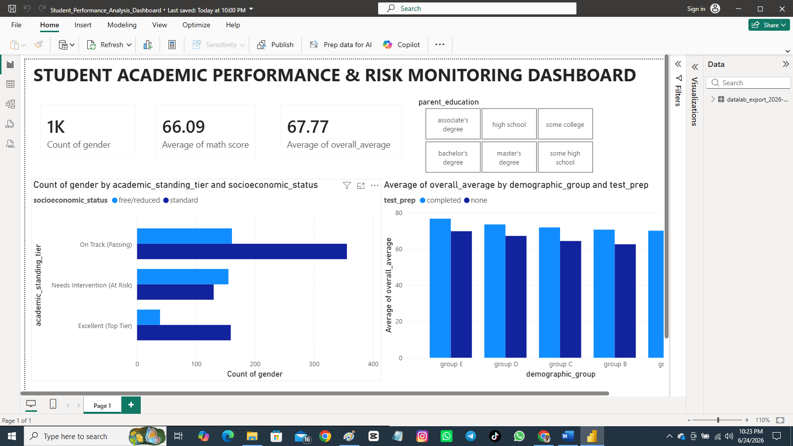

# Student Academic Performance & Risk Monitoring Dashboard

## 📌 Project Overview
Welcome! This project bridges the gap between raw student data and actionable educational insights. I wanted to explore how background demographics and socioeconomic factors impact student success, and visually flag which students genuinely need early academic intervention. 

Using **SQL**, I cleaned the raw dataset and engineered custom risk tiers. Then, I built an interactive **Power BI** dashboard to give school executives a clear, dynamic view of student performance metrics at a single glance.

---

## The Dashboard Look & Feel

*An interactive snapshot of the completed executive monitoring matrix.*

---

## Tech Stack & Skills Showcased
* **Data Engineering & Cleaning:** SQL (Conditional logic, aggregations, feature engineering)
* **Data Visualization:** Power BI Desktop (KPI cards, clustered distribution charts, dynamic slicer deployment)
* **Core Analytics:** Cross-referencing socioeconomic indicators against academic output.

---

## Key Data Insights Discovered
* **Socioeconomic Impact:** Students on free/reduced lunch programs make up the largest percentage of the *Needs Intervention (At Risk)* tier, visually proving a strong correlation between socioeconomic support and academic struggle.
* **The Power of Prep:** Across *every single demographic group* (Groups A through E), students who completed the test preparation course achieved a noticeably higher overall average score than those who did not. 
* **The Bottom Line:** Our system tracks **1,000 students** maintaining a global overall average score of **67.77**, with math scores slightly lagging behind at an average of **66.09**.

---

## How to Explore This Project
* Check out the raw data in `StudentsPerformance.csv`.
* Read the exact data transformation logic in `student_performance_cleaning.sql`.
* Download and interact with the live report via the `Student_Performance_Analysis_Dashboard.pbix` file.
